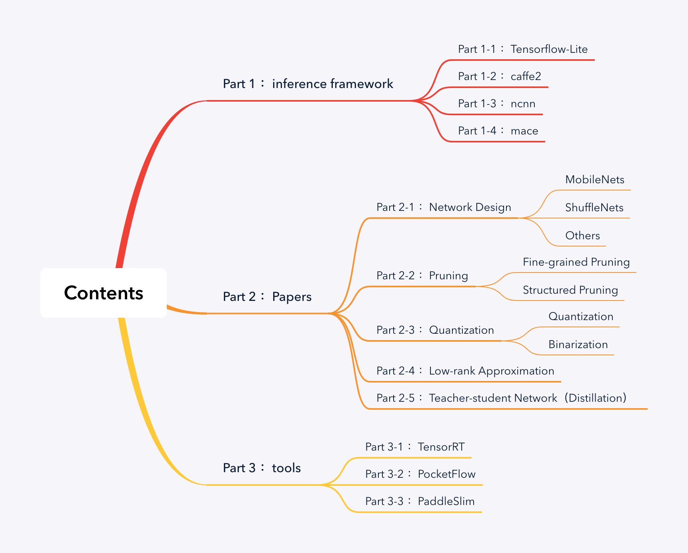
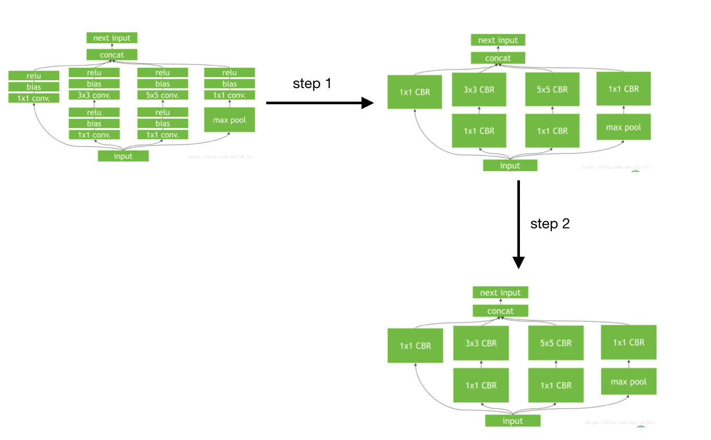

# Not-Awesome model compressing

## Contents

## Part 1 ：inference framework

### Part 1-1 ：[Tensorflow-Lite](https://www.tensorflow.org/lite)

#### adding...

### Part 1-2 ：[caffe2](https://caffe2.ai)

#### adding...

### Part 1-3 ：[ncnn](https://github.com/Tencent/ncnn)

#### adding...

### Part 1-4 ：[mace](https://github.com/XiaoMi/mace)

#### adding...

## Part 2 ：Papers

###  Part 2-1 ：Network Design

* #### MobileNets

  ##### 1、[Efficient Convolutional Neural Networks for Mobile Vision Applications](https://arxiv.org/abs/1704.04861)

  ##### 2、[MobileNetV2: Inverted Residuals and Linear Bottlenecks](https://arxiv.org/pdf/1801.04381.pdf)

  ##### 3、[Searching for MobileNetV3](https://arxiv.org/pdf/1905.02244.pdf) 

* #### ShuffleNets

  ##### 1、[An Extremely Efficient Convolutional Neural Network for Mobile Devices](https://arxiv.org/abs/1707.01083)

  ##### 2、[ShuffleNet V2: Practical Guidelines for Efficient CNN Architecture Design](https://arxiv.org/abs/1807.11164)

  ##### 3、[ShuffleNetV2+](https://github.com/hekesai/real-time-network/blob/master)

* #### SqueenzeNet

  ##### [SqueezeNet: AlexNet-level accuracy with 50x fewer parameters and <0.5MB model size](https://arxiv.org/abs/1602.07360)
  
* #### Others

  ##### adding........
  
* 

### Part 2-2 ：Pruning

* #### Fine-grained Pruning

  ##### 1、[Deep Compression:Compressing Deep Neural Networks with Pruning, Trained Quantization and Huffman Coding](https://arxiv.org/abs/1510.00149)   [github](https://github.com/songhan/Deep-Compression-AlexNet)  (2016)

  ##### 2、[Dynamic Network Surgery for Efficient DNNs](http://arxiv.org/abs/1608.04493)  [github](https://github.com/yiwenguo/Dynamic-Network-Surgery)  （2016）

  ##### 3、[The Lottery Ticket Hypothesis: Finding Sparse, Trainable Neural Networks](https://arxiv.org/abs/1803.03635)  [github](https://github.com/google-research/lottery-ticket-hypothesis)  （2019）

* #### Structured Pruning

  ##### 1、[Pruning Filters for Efficient ConvNets](https://arxiv.org/abs/1608.08710)  [github](https://github.com/Eric-mingjie/rethinking-network-pruning/tree/master/imagenet/l1-norm-pruning)  (2017)

  ##### 2、[Filter Pruning via Geometric Median for Deep Convolutional Neural Networks Acceleration](https://arxiv.org/abs/1811.00250)  [github](https://github.com/he-y/filter-pruning-geometric-median)  (2019)

### Part 2-3 ：Quantization

* #### Quantization

  ##### 1、[Quantized Convolutional Neural Networks for Mobile Devices](https://arxiv.org/abs/1512.06473)

  ##### 2、[Towards the Limit of Network Quantization](https://arxiv.org/abs/1612.01543)

  ##### 3、[Quantized Neural Networks: Training Neural Networks with Low Precision Weights and Activations](https://arxiv.org/abs/1609.07061)

  ##### 4、[Compressing Deep Convolutional Networks using Vector Quantization](https://arxiv.org/abs/1412.6115)

* #### Binarization

  ##### 1、[Binarized Convolutional Neural Networks with Separable Filters for Efficient Hardware Acceleration](https://arxiv.org/abs/1707.04693)

  ##### 2、[Binarized Neural Networks: Training Deep Neural Networks with Weights and Activations Constrained to +1 or -1](https://arxiv.org/abs/1602.02830)

  ##### 3、[Local Binary Convolutional Neural Networks](https://arxiv.org/abs/1608.06049)

  ##### 4、[XNOR-Net: ImageNet Classification Using Binary Convolutional Neural Networks](https://arxiv.org/abs/1603.05279)

  ##### 5、[DoReFa-Net: Training Low Bitwidth Convolutional Neural Networks with Low Bitwidth Gradients](https://arxiv.org/abs/1606.06160)

### Part 2-4 ：Low-rank Approximation

* #### Papers

  ##### 1、[Speeding up convolutional neural networks with low rank expansions](http://www.robots.ox.ac.uk/~vgg/publications/2014/Jaderberg14b/jaderberg14b.pdf) 

  ##### adding...

### Part 2-5 ：Teacher-student Network（Distillation）

* #### Papers

  ##### 1、 [Distilling the Knowledge in a Neural Network](https://arxiv.org/abs/1503.02531)

  #### adding...

## Part 3 ：tools

### Part 3-1 ：[TensorRT](https://docs.nvidia.com/deeplearning/sdk/tensorrt-developer-guide/index.html)

* #### 简介

  ##### The core of TensorRT™ is a C++ library that facilitates high performance inference on NVIDIA graphics processing units (GPUs). It is designed to work in a complementary fashion with training frameworks such as TensorFlow, Caffe, PyTorch, MXNet, etc. It focuses specifically on running an already trained network quickly and efficiently on a GPU for the purpose of generating a result (a process that is referred to in various places as scoring, detecting, regression, or inference). 

  ##### Some training frameworks such as TensorFlow have integrated TensorRT so that it can be used to accelerate inference within the framework. Alternatively, TensorRT can be used as a library within a user application. It includes parsers for importing existing models from Caffe, ONNX, or TensorFlow, and C++ and Python APIs for building models programmatically. （搬抄官网）

  ##### *Figure 1. TensorRT is a high performance neural network inference optimizer and runtime engine for production deployment.*

  

* #### 框架介绍

* #### 基本原理

  #### 在计算资源并不丰富的嵌入式设备上，TensorRT之所以能加速神经网络的的推断主要得益于两点 :

  ##### 1、首先是TensorRT支持int8和fp16的计算，通过在减少计算量和保持精度之间达到一个理想的trade-off，达到加速推断的目的。

  ##### 2、更为重要的是TensorRT对于网络结构进行了重构和优化，主要体现在一下几个方面。

  ##### (1) TensorRT通过解析网络模型将网络中无用的输出层消除以减小计算。

  ##### (2) 对于网络结构的垂直整合，即将目前主流神经网络的Conv、BN、Relu三个层融合为了一个层，例如将图所示 step1 的常见的Inception结构重构为图2所示的网络结构。

  ##### (3) 对于网络结构的水平组合，水平组合是指将输入为相同张量和执行相同操作的层融合一起，例如图 step2 的转化。

 

* #### TensorRT如何优化重构模型？

| 条件                                     | 方法                                                         |
| ---------------------------------------- | :----------------------------------------------------------- |
| 若训练的网络模型包含TensorRT支持的操作   | 1、对于Caffe与TensorFlow训练的模型，若包含的操作都是TensorRT支持的，则可以直接由TensorRT优化重构 |
|                                          | 2、对于MXnet, PyTorch或其他框架训练的模型，若包含的操作都是TensorRT支持的，可以采用TensorRT API重建网络结构，并间接优化重构； |
| 若训练的网络模型包含TensorRT不支持的操作 | 1、TensorFlow模型可通过tf.contrib.tensorrt转换，其中不支持的操作会保留为TensorFlow计算节点； |
|                                          | 2、不支持的操作可通过Plugin API实现自定义并添加进TensorRT计算图； |
|                                          | 3、将深度网络划分为两个部分，一部分包含的操作都是TensorRT支持的，可以转换为TensorRT计算图。另一部则采用其他框架实现，如MXnet或PyTorch； |

* #### 性能

  #### 以下是在TitanX (Pascal)平台上，TensorRT对大型分类网络的优化加速效果：

  | Network   | Precision | Framework/GPU:TitanXP | Avg.Time(Batch=8,unit:ms) | Top1 Val.Acc.(ImageNet-1k) |
  | --------- | --------- | --------------------- | ------------------------- | -------------------------- |
  | Resnet50  | fp32      | TensorFlow            | 24.1                      | 0.7374                     |
  | Resnet50  | fp32      | MXnet                 | 15.7                      | 0.7374                     |
  | Resnet50  | fp32      | TRT4.0.1              | 12.1                      | 0.7374                     |
  | Resnet50  | int8      | TRT4.0.1              | 6                         | 0.7226                     |
  | Resnet101 | fp32      | TensorFlow            | 36.7                      | 0.7612                     |
  | Resnet101 | fp32      | MXnet                 | 25.8                      | 0.7612                     |
  | Resnet101 | fp32      | TRT4.0.1              | 19.3                      | 0.7612                     |
  | Resnet101 | int8      | TRT4.0.1              | 9                         | 0.7574                     |

### Part 3-2 ：[PocketFlow](https://github.com/Tencent/PocketFlow)

* #### 简介

  #### PocketFlow是腾讯开源的模型压缩与加速框架，基于TensorFlow，集成目前主流的模型压缩技术。开发者无需知道模型压缩算法的细节，就可以实现深度学习的移动端部署。

* #### 框架介绍

  #### PocketFlow 框架主要由两部分组件构成，分别是模型压缩/加速算法组件和超参数优化组件，具体结构如下图所示。

  

  #### 开发者将未压缩的原始模型作为 PocketFlow 框架的输入，同时指定期望的性能指标，例如模型的压缩和/或加速倍数；在每一轮迭代过程中，超参数优化组件选取一组超参数取值组合，之后模型压缩/加速算法组件基于该超参数取值组合，对原始模型进行压缩，得到一个压缩后的候选模型；基于对候选模型进行性能评估的结果，超参数优化组件调整自身的模型参数，并选取一组新的超参数取值组合，以开始下一轮迭代过程；当迭代终止时，PocketFlow 选取最优的超参数取值组合以及对应的候选模型，作为最终输出，返回给开发者用作移动端的模型部署。

* #### 基本原理

  #### 具体地，PocketFlow 通过下列各个算法组件的有效结合，实现了精度损失更小、自动化程度更高的深度学习模型的压缩与加速：

  ##### 1、通道剪枝（channel pruning）组件：在CNN网络中，通过对特征图中的通道维度进行剪枝，可以同时降低模型大小和计算复杂度，并且压缩后的模型可以直接基于现有的深度学习框架进行部署。在CIFAR-10图像分类任务中，通过对 ResNet-56 模型进行通道剪枝，可以实现2.5倍加速下分类精度损失0.4%，3.3倍加速下精度损失0.7%。

  ##### 2、权重稀疏化（weight sparsification）组件：通过对网络权重引入稀疏性约束，可以大幅度降低网络权重中的非零元素个数；压缩后模型的网络权重可以以稀疏矩阵的形式进行存储和传输，从而实现模型压缩。对于 MobileNet 图像分类模型，在删去50%网络权重后，在 ImageNet 数据集上的 Top-1 分类精度损失仅为0.6%。

  ##### 3、权重量化（weight quantization）组件：通过对网络权重引入量化约束，可以降低用于表示每个网络权重所需的比特数；团队同时提供了对于均匀和非均匀两大类量化算法的支持，可以充分利用 ARM 和 FPGA 等设备的硬件优化，以提升移动端的计算效率，并为未来的神经网络芯片设计提供软件支持。以用于 ImageNet 图像分类任务的 ResNet-18 模型为例，在8比特定点量化下可以实现精度无损的4倍压缩。

  ##### 4、网络蒸馏（network distillation）组件：对于上述各种模型压缩组件，通过将未压缩的原始模型的输出作为额外的监督信息，指导压缩后模型的训练，在压缩/加速倍数不变的前提下均可以获得0.5%-2.0%不等的精度提升。

  ##### 5、多GPU训练（multi-GPU training）组件：深度学习模型训练过程对计算资源要求较高，单个GPU难以在短时间内完成模型训练，因此团队提供了对于多机多卡分布式训练的全面支持，以加快使用者的开发流程。无论是基于 ImageNet 数据的Resnet-50图像分类模型还是基于 WMT14 数据的 Transformer 机器翻译模型，均可以在一个小时内训练完毕。[1]

  ##### 6、超参数优化（hyper-parameter optimization）组件：多数开发者对模型压缩算法往往不甚了解，但超参数取值对最终结果往往有着巨大的影响，因此团队引入了超参数优化组件，采用了包括强化学习等算法以及 AI Lab 自研的 AutoML 自动超参数优化框架来根据具体性能需求，确定最优超参数取值组合。例如，对于通道剪枝算法，超参数优化组件可以自动地根据原始模型中各层的冗余程度，对各层采用不同的剪枝比例，在保证满足模型整体压缩倍数的前提下，实现压缩后模型识别精度的最大化。

  

* #### 性能

  ##### 通过引入超参数优化组件，不仅避免了高门槛、繁琐的人工调参工作，同时也使得 PocketFlow 在各个压缩算法上全面超过了人工调参的效果。以图像分类任务为例，在 CIFAR-10 和 ImageNet 等数据集上，PocketFlow 对 ResNet 和 MobileNet 等多种 CNN 网络结构进行有效的模型压缩与加速。

  ##### 在 CIFAR-10 数据集上，PocketFlow 以 ResNet-56 作为基准模型进行通道剪枝，并加入了超参数优化和网络蒸馏等训练策略，实现了 2.5 倍加速下分类精度损失 0.4%，3.3 倍加速下精度损失 0.7%，且显著优于未压缩的 ResNet-44 模型； 在 ImageNet 数据集上，PocketFlow 可以对原本已经十分精简的 MobileNet 模型继续进行权重稀疏化，以更小的模型尺寸取得相似的分类精度；与 Inception-V1、ResNet-18 等模型相比，模型大小仅为后者的约 20~40%，但分类精度基本一致（甚至更高）。

  
  
  
  
  ##### 相比于费时费力的人工调参，PocketFlow 框架中的 AutoML 自动超参数优化组件仅需 10 余次迭代就能达到与人工调参类似的性能，在经过 100 次迭代后搜索得到的超参数组合可以降低约 0.6% 的精度损失；通过使用超参数优化组件自动地确定网络中各层权重的量化比特数，PocketFlow 在对用于 ImageNet 图像分类任务的 ResNet-18 模型进行压缩时，取得了一致性的性能提升；当平均量化比特数为 4 比特时，超参数优化组件的引入可以将分类精度从 63.6% 提升至 68.1%（原始模型的分类精度为 70.3%）。
  
  
  
  

### Part 3-3 ：[PaddleSlim](https://github.com/PaddlePaddle/models/tree/v1.4/PaddleSlim)

* #### 简介

* #### 框架介绍

* #### 基本原理

* #### 性能

